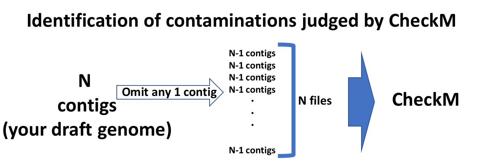

## search-contamination
**CheckMによってcontaminationと判定された遺伝子が含まれるcontigを探索するためのスクリプト**

## search annotation file
**アノテーションファイルから、指定するキーワードを含む行を抽出しします。**

## Usage
```
$ extraction.py [-h] -a ANNOTATION -c COL_NAME [-k KEYWARDS]
```

## optional arguments
```
  -h, --help            show this help message and exit
  -a ANNOTATION         specify the path to your annotation file(ex. ~.xlsx) which number of sheet is 1
  -c COL_NAME           specify the column name you want to search
  -k [KEYWARDS [KEYWARDS ...]]
                        specify the keywords(default:transport facilitator permease antiporter symporter
```
